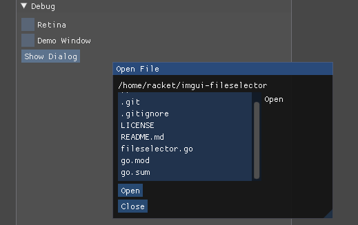

# A file chooser for use with imgui in ebiten
## To use:

Create the file chooser and implement some callbacks:
```go
fileSelector, _ := imguifileselector.OpenFileSelector("<initial directory>")
fileSelector.OnChoosePressed = func(dir, file string) {
    log.Printf("YOU CHOSE %v\n", filepath.Join(dir, file))
}
fileSelector.OnClosePressed = func() {
    log.Printf("YOU CLOSED THE DIALOG")
}
```
Between BeginFrame() and EndFrame() call the dialogs update function:
```go
fileSelector.Update()
if imgui.Button("Show Dialog") {
    imgui.OpenPopup(fileSelector.DialogLabel())
}
```
